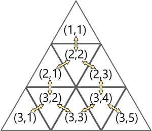

Problem
-------
A new art museum is about to open! It is a single-story building in the shape of a large equilateral triangle. That triangle is made up of many smaller identical equilateral-triangle-shaped rooms, and the side length of the museum is S times the side length of any one of the rooms. Each room has doors connecting it to all other rooms with which it shares a side (not just a vertex).

Each room is identified by two numbers: the row of the building it is in (counting from top to bottom, starting from 1), followed by its position within that row (counting from left to right, starting from 1). Here is an example of how the rooms are connected and labeled when S = 3:

Input
-----
The first line of the input gives the number of test cases, T. T test cases follow. Each case begins with one line containing six integers S, RA, PA, RB, PB, and C. Respectively, these are the side length of the museum (as a multiple of the side length of a room), the row and position of Alma's starting room, the row and position of Berthe's starting room, and the number of rooms that are under construction. Then, there are C more lines. The i-th of these lines (counting starting from 1) contains two integers Ri and Pi, representing the row and position of the i-th room that is under construction.
Output
------
For each test case, output one line containing Case #x: y, where x is the test case number (starting from 1) and y is the space separated list of integers that denote the order in which the people leave the queue.

Limits
------
| Time limit: 20 seconds per test set.
| Memory limit: 1GB.
| 1 ≤ T ≤ 100.

Test Set 1
~~~~~~~~~~~
| 1 ≤ **N** ≤ 100.
| 1 ≤ **Ai** ≤ 100.
| 1 ≤ **X** ≤ 100.

Test Set 2
~~~~~~~~~~
| 1 ≤ **N** ≤ 105 for at most 10 test cases. For the remaining cases, 1 ≤ N ≤ 100
| 1 ≤ **Ai** ≤ 109.
| 1 ≤ **X** ≤ 109.

Sample
------
::

    Input           Output
    2
    3 3
    2 7 4           Case #1: 1 3 2
    5 6             Case #2: 3 5 1 2 4
    9 10 4 7 2

In Sample Case #1, there are 3 people and the limit to withdraw in one turn is 3. Below 
is step-by-step description of how the process will look like:

1. The queue initially looks like [1, 2, 3]. The first person withdraws an amount of 2 in 
their first attempt and leaves the queue.

2. The queue now looks like [2, 3]. The second person wants to withdraw an amount of 
7, but they can withdraw only 3 in their first turn. Since they still need to withdraw an 
amount of 4, they have to rejoin the queue at the end of the line.

3. The queue now looks like [3, 2]. The third person needs to withdraw an amount of 4 
but they can only withdraw 3 in their first turn so, they rejoin the queue at the end of 
the line to withdraw amount of 1 later.

4. The queue now looks like [2, 3]. The second person still needs to withdraw an 
amount of 4. They withdraw an amount of 3 in their second turn and waits for their 
next turn to arrive to withdraw the remaining amount of 1.

5. The queue now looks like [3, 2]. The third person withdraws the remaining amount of 
1 and leaves the queue.

6. The queue now looks like [2]. The second person withdraws the remaining amount 
of 1 and leaves the queue.

7. The queue is now empty.
The order in which people leave the queue is [1, 3, 2].

In Sample Case #2, there are 5 people and the limit to withdraw in one turn is 6. Below 
is step-by-step description of how the process will look like:

1. The queue initially looks like [1, 2, 3, 4, 5]. The first person withdraws an amount of 6, 
and joins at the end again to withdraw the remaining amount of 3 later.

2. The queue looks like [2, 3, 4, 5, 1]. The second person similarly withdraws an amount 
of 6 and waits for his next turn to withdraw an amount of 4.

3. The queue looks like [3, 4, 5, 1, 2]. The third person withdraws an amount of 4 and 
leaves the queue.

4. The queue now looks like [4, 5, 1, 2]. The fourth person withdraws 6 and waits for his 
next turn.

5. The queue looks like [5, 1, 2, 4]. The fifth person withdraws amount of 2 and leaves 
the queue.

6. The queue looks like, [1, 2, 4]. All other people now leave the queue after their 
second turn one by one.
The order in which people leave the queue is [3, 5, 1, 2, 4].
